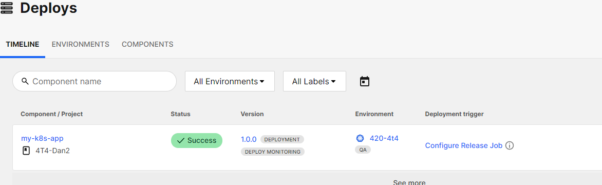

# 1. Configurer CircleCI

Aller sur https://app.circleci.com/home

Créer une organisation  (Start a new organization - Organizations are shared contexts for people and projects on CircleCI)

Aller sur "Organization Home"


Faire les étapes de https://circleci.com/docs/deploy/set-up-circleci-deploys/#set-up-circleci-deploys

Attention : mettre les bons namespace


Une fois que vous avez fait la commande helm upgrade --install circleci-release-agent-system

Demandez à l'enseignant de venir vérifier votre installation pour le valider


````
helm list --namespace circleci-release-agent-system

kubectl get all --namespace circleci-release-agent-system
````

<br>

# 2 Créer un projet.


Cliquez sur create project


<br>
<br>
Sélectionnez cette option
<br><br>


Donnez le nom 4T4-Votre numero Etudiant et Faites "Next : choose a repo"

Cliquz sur add, choisissez Github et cliquez sur "Authorize in GitHub". Entrez votre mot de passe GitHub


Sélectionnez votre projet "my-k8s-app"


<br>
<br>


Revenir à la fenêtre de CircleCi et sélectinnez le projet "my-k8s-app"

Copier et coller l'information du fichier config.yml et sauvegarder le fichier sur votre vm. Faite "Next: set up triggers"

Clicker sur "Next : review and finish setup ->"  et Finish setup.


Et voir que l'agent est Online sur le site.
<br><br><br>
# 3. Modifier le manifeste du projet et créer des secrets

Aller sur "Projects" de la barre verticale et cliquez sur les "..." -> "Project settings" de votre projet.

- Récupérer votre "project ID"

- Modifier le manifeste deployment.yaml dans le répertoire K8 avec les info de votre projet CircleCI.
<br><br>
Ensuite, il faut créer 2 secret qui permettront à CircleCi d'accéder à votre docker Hub de manière sécuritaire.

- Aller sur "Projects" de la barre verticale et cliquez sur les "..." -> "Project settings" -> "Environment Variable"

- Ajouter 2 variables

  - DOCKERHUB_USERNAME: Your Docker Hub username.
  
  - DOCKERHUB_PASSWORD: Your Docker Hub password.
<br><br>

Modifier le fichier config.yam dans le répertoire du projet .CircleCi.

- Changez "Dancegep" pour le nom de votre repo DockerHub.
  

# 4. Vérifier que tout est en place
<br><br>

Cliquez sur le menu vertical de gauche sur "Deploys"
<br><br>
Vous devriez avoir ceci
<br><br>

